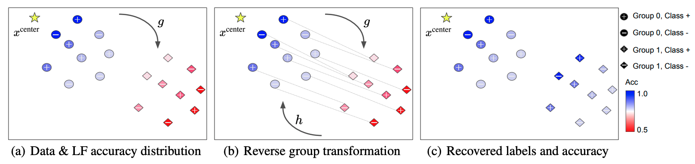

# Mitigating Source Bias for Fairer Weak Supervision



This repository provides the official implementation of the following paper: 

**Mitigating Source Bias for Fairer Weak Supervision (NeurIPS 2023)**  
Changho Shin, Sonia Cromp, Dyah Adila, Frederic Sala


## Installation

We recommend you create a conda environment as follows.

```
conda env create -f environment.yml
```

and activate it with

```
conda activate fair-ws
```


## Datasets

Preprocessed datasets and cached SBM mappings can be downloaded [here](https://www.dropbox.com/sh/7hwqrigdn5oehn7/AACBq7q-eKuOkKQi5nxM01IKa?dl=0). Dataset folders should be located under `data` folder, i.e.

````
```
fair-ws/
    data/
        adult/
        bank_marketing/
        CelebA/
        census/
        CivilComments
        hateXplain
        imdb
        tennis
        UTKFace
    fairws
    notebook
```

````

It can be done by the following command lines. It may take ~30 minutes (6.24GB).

```
cd fair-ws
mkdir data
cd data
wget https://www.dropbox.com/sh/7hwqrigdn5oehn7/AACBq7q-eKuOkKQi5nxM01IKa -O datasets.zip
unzip datasets.zip
```


## Sample Usage
```
from fairws.data_util import load_dataset
from fairws.sbm import find_sbm_mapping, correct_bias

# load data and LF; a_train and a_test are group variables
x_train, y_train, a_train, x_test, y_test, a_test = load_dataset(...)
L = load_LF(...))

# Source bias mitigation (SBM)
ot_type = "linear"
sbm_diff_threshold = 0.05
sbm_mapping = find_sbm_mapping(x_train, a_train, ot_type)
L = correct_bias(L, a_train, sbm_mapping, sbm_diff_threshold)                

# Standard weak supervision pipeline
label_model = LabelModel(...)
label_model.fit(L_train=L, ...)
y_train_pseudo = label_model.predict(L, ...)  
                                                                    
```


## Experiments

* [Real experiment](https://github.com/SprocketLab/fair-ws/blob/main/notebook/01_real_data_experiment.ipynb) - Section 5.1.
* [Synthetic experiment](https://github.com/SprocketLab/fair-ws/blob/main/notebook/02_synthetic_data_experiment.ipynb)  - Section 5.2.
* [FairML compatibility experiment](https://github.com/SprocketLab/fair-ws/blob/main/notebook/03_compatibility_experiment.ipynb) - Section 5.3.
* [SBM + Domino experiment](https://github.com/SprocketLab/fair-ws/blob/main/notebook/04_domino_experiment.ipynb) - Section 5.4.

### Citation
If you find our repository useful for your research, please consider citing our paper:
```
@article{shin2023mitigating,
  title={Mitigating Source Bias for Fairer Weak Supervision},
  author={Shin, Changho and Cromp, Sonia and Adila, Dyah and Sala, Frederic},
  journal={arXiv preprint arXiv:2303.17713},
  year={2023}
}
```
